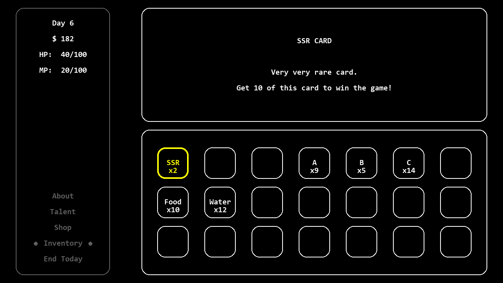

# Pygame Boy Advance

> 个人 pygame 游戏作品合集

## 环境配置

* Python 3.11+
* pygame >= 2.6.0

### Windows

#### 使用 venv 配置虚拟环境（推荐）

```
> python -m venv <venv_name>
> <venv_name>\Scripts\activate
> python -m pip install --upgrade pip wheel
> pip install -r requirements.txt
```

## 启动游戏

```
python pygame_boy_advance.py
```

### 基本操作

上下键切换选项

`Z` 键启动选项对应的游戏

右上角 `X` 退出程序

### 注意事项

关闭中文输入法

### 调试模式

```
python -m pdb pygame_boy_advance.py
```

## 游戏介绍

### 卡片囚徒 (Card Prisoner)

#### 游戏截图



#### 开发状态

已经具备一款游戏的基本结构，并具有一定的可玩性

#### 游戏简介

这是一款 rogue-like 模拟经营游戏，灵感源自一款[独立手游作品](https://indienova.com/g/drawcardlife)

#### 基本操作

上下左右键切换选项

`Z` 键确认

`X` 键返回

`D` 键抽卡，长按连续抽卡

#### 胜利条件

抽到 10 张 SSR 卡

#### 失败条件

HP == 0 或 MP == 0

### 魔塔 (Magic Tower)

#### 开发状态

未完成（策划中）

### 中国跳棋 (Chinese Checkers)

#### 开发状态

未完成（策划中）

## 版本历史

更多细节详见 [CHANGELOG](./CHANGELOG.md)

* v0.2
  * 一个实现了基础的“商店”和“天赋”界面的 Card Prisoner 游戏
  * 在项目文档中增加了 UML 类图
* v0.1
  * 一个结构完整、有始有终的 Card Prisoner 游戏
  * 一个用于启动 Card Prisoner 以及后续作品的主界面
  * 一个结构基本完整的项目目录结构

## 许可证

本项目使用 MIT 许可证。查看 [LICENSE](./LICENSE) 以获得更多信息。

本项目使用的游戏素材有一部分来自[HTML5魔塔样板](https://github.com/ckcz123/mota-js)。该项目使用 BSD-3-Clause 许可证。

## 关于

### 项目背景

之所以编写这个项目，主要是为了丰富自己的简历

过去的 5 年里使用 pygame 编写了一些零碎的程序，希望利用这次机会对过去的经验和教训进行总结，并呈现一些较为完整的作品

### 项目名称

项目名称源自于 Nintendo 的著名游戏机 Game Boy Advance 以及针对该游戏机的 PC 端模拟器 [Visual Boy Advance](https://visualboyadvance.org/)

Game Boy Advance 的特点是玩家只能通过方向键和几个有限的按键与游戏进行交互，而不存在鼠标这样的外设

另一方面，我发现自己之前使用 pygame 开发游戏时，一个主要的复杂度来自于对鼠标相关事件的处理，因此在这个项目里，为了简化设计，大多数情况下直接舍弃了鼠标相关的事件
