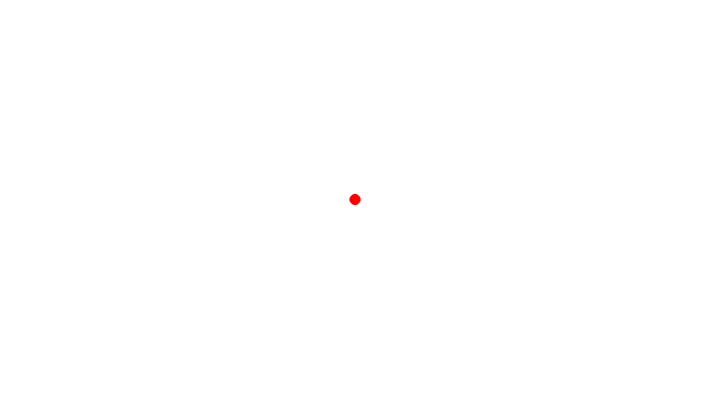
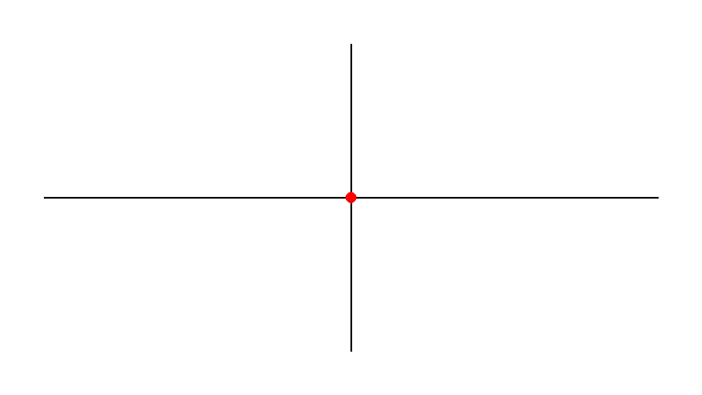

# Mini PBL Project: 绘制平面直角坐标系

## 任务描述


## 关键词

## 第 1 步：准备工作

### 创建画布

每一个 pygame 程序都运行在一个窗口中，
之后，我们将把这个窗口作为画布，在这块画布上面完成我们的绘制任务。
现在，让我们首先创建一个窗口：
```py
CANVAS_WIDTH = 1280
CANVAS_HEIGHT = 720
canvas = pygame.display.set_mode((CANVAS_WIDTH, CANVAS_HEIGHT))
```

### 定义颜色常量

在接下来的绘制工作中，我们需要用到一些常见的颜色。
在计算机上存储颜色的方式有很多种，其中最常用的方式是 RGB 模式。
通过指定红 (Red) 绿 (Greed) 蓝 (Blue) 三种颜色的强度，我们可以定义各种各样的颜色。
这里，我们只需要定义黑、白、红 3 种颜色：
```py
from pygame import Color
WHITE = Color(255, 255, 255)
BLACK = Color(0, 0, 0)
RED = Color(255, 0, 0)
```

### 将画布清空

定义完常用的颜色之后，我们可以将画布填充为我们想要的颜色
```py
canvas.fill(WHITE)
pygame.display.update()
```

现在，我们的画布被填充为一片空白


## 第 2 步：绘制原点

我们希望在画布的中心绘制原点
```py
ORIGIN = (CANVAS_WIDTH / 2, CANVAS_HEIGHT / 2)
```

绘制一个点，本质上就是绘制一个圆，因此我们只需调用 `pygame.draw.circle` 函数
```py
DOT_RADIUS = 5
pygame.draw.circle(canvas, RED, ORIGIN, DOT_RADIUS)
```
注意，除了说明圆心的坐标外，我们还需要说明圆圈的半径，因此定义了一个新的常量 `DOT_RADIUS`

如果想要立即看到绘制之后的效果，需要调用 `pygame.display.update` 函数，通知窗口进行更新：
```py
pygame.display.update()
```



现在我们可以看到，画布的中央出现了一个红色的圆点。

恭喜你，成功绘制了坐标系的原点！

## 第 3 步：绘制坐标轴

接下来让我们绘制 2 条坐标轴。

坐标轴是由一条线段以及一个箭头组成的，下面，首先让我们绘制线段。

### 绘制线段

绘制线段需要使用 `pygame.draw.line` 函数。
```py
CENTERY = int(CANVAS_HEIGHT / 2)
# 绘制 x 轴
start = (0, CENTERY)
end = (CANVAS_WIDTH, CENTERY)
pygame.draw.line(canvas, BLACK, start, end)
```
在最后一行代码中，我们以此指定了画布、线段的颜色、线段的起点、线段的终点。
由于 x 轴位于画布的垂直中心，因此我们定义了一个新的常量 `CENTERY` 来表示这个值。

为了保持美观，我们希望所绘制的线段和窗口的边缘之间存在一段距离，
因此可以额外定义一个 `PADDING` 变量，表示留白的空间。
```py
PADDING = 80
start = (0 + PADDING, CENTERY)
end = (CANVAS_WIDTH - PADDING, CENTERY)
```

同时，为了使坐标轴与后面绘制的栅格相区别，我们定义两种线段的粗细：
```py
THIN = 1
THICK = 2
```

重新调用 `pygame.draw.line` 函数，并在最后加上表示线段粗细的参数：
```py
pygame.draw.line(canvas, BLACK, start, end, THICK)
```

绘制 y 轴的方法是类似的：
```py
CENTERX = int(CANVAS_WIDTH / 2)
start = (CENTERX, CANVAS_HEIGHT - PADDING)
end = (CENTERX, 0 + PADDING)
pygame.draw.line(canvas, BLACK, start, end, THICK)
```

最后，不要忘记更新屏幕：
```py
pygame.display.update()
```

此时的效果如下：


### 可选：添加箭头

...

<!-- ### 高阶挑战：封装 draw_arrow 函数 -->

## 第 4 步：绘制栅格

## 第 5 步：绘制 y = kx + b

## 第 6 步：简易的事件处理
